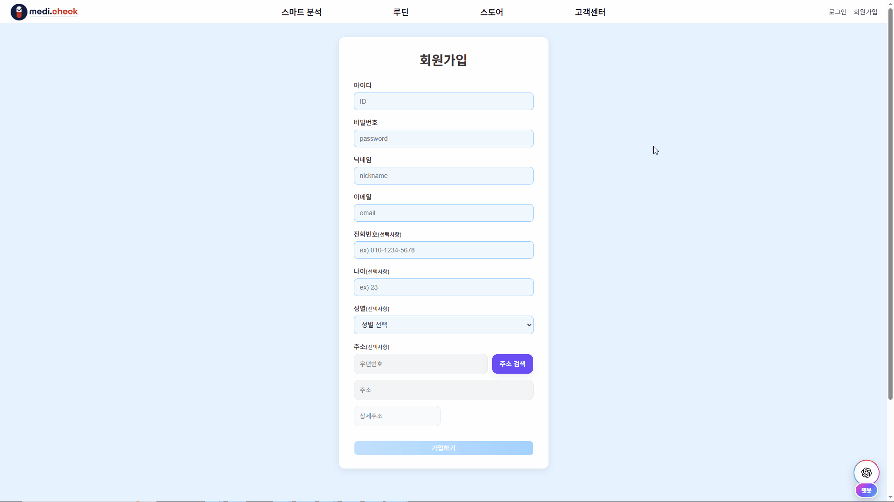
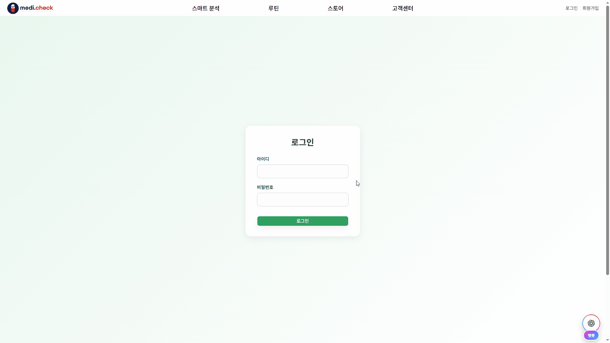
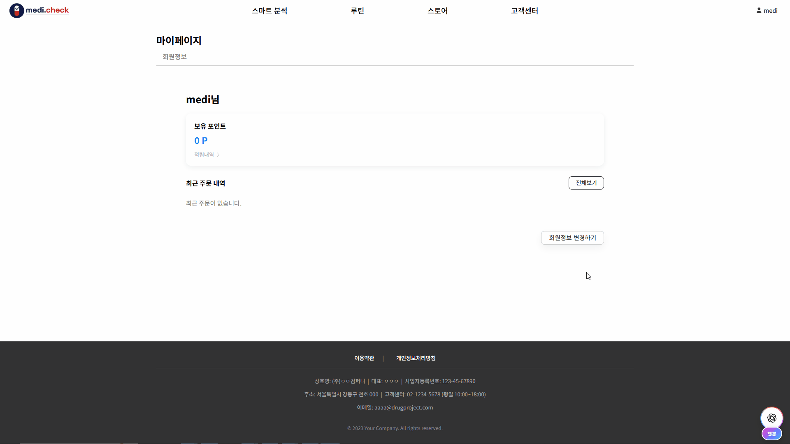

# 💊Medi.Check!
Medi.Check!는 복용 중인 의약품과 영양제를 안전하게 관리할 수 있도록 도와주는 사이트입니다.


[🔗Backend Github](https://github.com/guswlsl1216/drug_project_back.git)

</br>

## 목차
- [프로젝트 개요](#프로젝트-개요)
- [주요 기능](#주요-기능)
- [기술 스택](#기술-스택)
- [주요 사용 라이브러리](#주요-사용-라이브러리)
- [사용한 모델 & 데이터](#사용한-모델--데이터)
- [기능 상세](#기능-상세)
- [팀원 및 역할](#팀원-및-역할)
- [설치 및 실행 방법](#설치-및-실행-방법)


## 프로젝트 개요
### 개발 기간
2025.10.22 ~ 2025.11.28 (38일)

### 기획 의도
본 프로젝트는 의약품 및 건강기능식품을 더욱 안전하게 복용할 수 있는 편리한 서비스를 만들겠다는 목적으로 기획되었습니다.

기존에는 의약품이나 건강기능식품을 함께 복용해야 할 때, 의약품 간 병용 금기만을 파악하거나 소비자가 일일이 주의사항을 조사해야 한다는 아쉬움이 있었습니다. 또한 약 분석·복용 일정 관리·쇼핑 등 건강 관련 기능들이 하나의 서비스에 통합되어 있지 않아 사용자 경험이 분산되어 있었습니다.

이 프로젝트는 YOLO 기반 약품 이미지 감지를 통한 분석, 악플 감지 모델을 활용한 댓글 필터링, 유저 중심의 서비스(루틴, 쇼핑)를 결합하여 안전한 복용 관리에 필요한 기능을 한 곳에서 제공하는 것을 목표로 합니다.


## 주요 기능
#### 의약품 & 영양제 분석

의약품과 의약품 또는 의약품과 영양제를 비교 분석하여 병용섭취, 중복 성분 등 상호작용 결과를 보여줍니다. YOLO모델 학습을 통해 업로드된 사진에서 의약품을 식별할 수 있도록 구현했습니다.

#### 복용 루틴

복용 중인 의약품이나 영양제를 등록하고, 매일 복용했을 때마다 캘린더에 체크할 수 있습니다.

#### 스토어

Medi.Check!에서 판매하는 영양제들을, 복용 중인 의약품과 함께 섭취해도 되는지 확인한 후에 안전하게 구매할 수 있습니다. 제품 리뷰는 악성 댓글 모델을 통해 악성 댓글을 감지하여 필터링 되도록 구현했습니다.


## 기술 스택
### Frontend
- React 19
- Vite 7
- React Router
- Axios

### Backend
- Python 3.11
- Flask 3.1
- Flask-JWT-Extended
- Flask-SQLAlchemy
- MySQL

### AI / ML
- YOLOv8 (Ultralytics)
- TensorFlow 2.20
- PyTorch 2.9
- OpenCV
 

## 주요 사용 라이브러리
### Frontend
- Tiptap Editor
- FullCalendar
- React-Bootstrap
- FontAwesome
- Toss Payments SDK
- UUID
- Daum 주소 검색 API
- OpenAI (챗봇)

### Backend
- APScheduler
- Flask APScheduler
- Flask-Mail
- Pillow
- Polars


## 사용한 모델 & 데이터
### 악성 댓글 감지 모델
- 모델 : beomi/kcELECTRA-base
- 학습 데이터(커뮤니티 데이터) : 직접 수집한 DC Inside 게시글/댓글 데이터 (연구·학습 목적, 비배포)
- 학습 데이터(한국어 혐오표현 분류) : [SmilingGate AI – UnSmile Dataset](https://huggingface.co/datasets/smilegate-ai/kor_unsmile)

### 의약품 이미지 인식 모델
- 모델 : YOLOv8 (Ultralytics)
- 학습 데이터 : [경구약제 이미지 데이터](https://aihub.or.kr/aihubdata/data/view.do?dataSetSn=576)

### 의약품/건강기능식품 관련 데이터
- 의약품 데이터 : [식품의약품안전처_의약품 제품 허가정보](https://www.data.go.kr/data/15095677/openapi.do)
- 건강기능식품 데이터 : [식품의약품안전처_건강기능식품 품목제조신고(원재료)](https://www.data.go.kr/data/15061756/openapi.do)
- 의약품 병용금기 데이터 : [한국의약품안전관리원_병용금기약물](https://www.data.go.kr/data/15089525/fileData.do)
- 건강기능식품-의약품 병용섭취 데이터 : [건강기능식품 종합정보 서비스](https://data.mfds.go.kr/hid/main/main.do)


## 기능 상세
<details>
<summary><b>회원 기능</b></summary>
<div markdown="1">
<h3>👤 회원가입</h3>

- 회원가입 : 전화번호와 주소는 선택사항이지만, 미리 작성해 두면 상품 주문 시 수월하게 배송지 정보를 입력할 수 있습니다.

  <br/>

- 로그인

  

- 회원정보 수정

  

- 고객센터 문의
(gif)
</div>
</details>

<details>
<summary><b>의약품 & 영양제 분석</b></summary>
<div markdown="1">
<h3>💊 의약품 & 영양제 분석</h3>

1. 의약품 추가 : 사진을 찍어 검사하거나 직접 약품명을 입력하여 추가할 수 있습니다.
(gif)

2. 영양제 추가 : 영양제 제품명을 입력하여 추가할 수 있습니다.
(gif)

3. 결과 보기 버튼을 누르면 의약품-영양제 간 상호작용 분석 결과를 알 수 있습니다. 돋보기 버튼을 누르면 분석된 의약품과 영양제의 상세정보를 볼 수 있습니다.
(gif)

4. 저장한 결과는 분석 결과 내역에서 확인할 수 있습니다.
(gif)
</div>
</details>

<details>
<summary><b>복용 루틴</b></summary>
<div markdown="1">
<h3>📆 복용 루틴</h3>

1. 복용약 등록 : '감기약', '탈모약' 등 원하는 이름으로 타이틀을 입력하고, 복용 시간과 복용 기간을 설정하여 등록할 수 있습니다.
(gif)

2. 영양제 등록 : '감기약', '탈모약' 등 원하는 이름으로 타이틀을 입력하고, 복용 시간과 복용 기간을 설정하여 등록할 수 있습니다.
(gif)

3. 등록된 약/영양제 목록을 한눈에 확인하며, 상세 내용을 수정하거나 삭제할 수 있습니다.
(gif)

4. 캘린더에서 날짜를 선택하여 등록된 약/영양제의 복용 여부를 시간대별로 직접 체크하고 기록할 수 있습니다.
(gif)

5. 전체 복용 히스토리와 설정 기간 대비 실제 복용 달성률을 확인할 수 있습니다.
(gif)
</div>
</details>

<details>
<summary><b>스토어</b></summary>
<div markdown="1">
<h3>🛒 스토어</h3>

- Medi.Check!에서 판매하는 영양제들을 구경할 수 있습니다.
(gif)

- 내가 고른 제품이 복용 중인 약과 함께 섭취해도 괜찮은지 확인할 수 있습니다.
(gif)

- 마음에 드는 제품을 찜할 수 있습니다.
(gif)

- 장바구니와 바로구매, 원하는 방식으로 결제할 수 있습니다. Medi.Check!는 토스페이를 비롯한 다양한 결제 방식을 지원하고 있습니다.
(gif)

- 구매한 제품에 대한 리뷰를 남길 수 있으며, 악플은 자동으로 감지되어 필터링됩니다.
(gif)

- 주문내역
(gif)

- 상품 Q&A
(gif)
</div>
</details>

<details>
<summary><b>챗봇</b></summary>
<div markdown="1">
<h3>💬 챗봇</h3>

우측 하단의 챗봇 메뉴를 눌러 챗봇을 사용할 수 있습니다. OpenAI가 의약품과 영양제 정보를 자세하게 알려줍니다.
(gif)
</div>
</details>

<details>
<summary><b>관리자 기능</b></summary>
<div markdown="1">
<h3>🔧 관리자 기능</h3>

- 상품 관리 : 관리자는 상품 등록, 수정, 품절 관리를 할 수 있습니다.
상품 등록
(gif)

상품 목록 & 수정
(gif)

품절 관리
(gif)

- 거래 내역 조회
(gif)

- 문의 내역 관리 : 상품 문의와 고객센터 문의를 관리할 수 있습니다.

상품 문의
(gif)

고객센터 문의
(gif)
</div>
</details>


## 팀원 및 역할
- **신승오(팀장)** : 의약품/영양제 분석 로직 설계 및 구현, 메인 페이지 UI
- **강미선** : YOLO모델 전처리 및 학습, 스토어 상품 목록/상세 페이지/찜 목록, 문의사항 및 QnA, 푸터
- **배연희** : 챗봇, 스토어 주문, 관리자 기능, api 데이터 DB 저장, 공통 컴포넌트 설계
- **송상윤** : 악성 댓글 모델 학습, 루틴 캘린더, 스토어 리뷰/포인트 적립 로직 설계
- **장수현** : YOLO모델 전처리 및 학습, 분석 결과 및 내역, 스토어 결제/퀵메뉴, 헤더
- **진현진** : 악성 댓글 모델 크롤링 및 전처리/학습, 루틴 관리/저장
- **한소연** : 회원 기능(JWT-로그인, 회원가입), 스토어 장바구니


## 설치 및 실행 방법
본 프로젝트는 개발 단계까지 진행되었으며, 실제 서비스 배포는 진행하지 않았습니다.
따라서 프론트엔드/백엔드의 빌드 및 배포 과정은 포함되어 있지 않습니다.
### 필수 요구사항
- Python 3.11
- Node.js 18+
- MySQL 8.0+

### Frontend
#### 1. 설치
```
npm install
```

#### 2. 개발 서버 실행
```
npm run dev
```

#### 3. .env 예시
```
FLASK_DEBUG=True
SQLALCHEMY_DATABASE_URI=mysql+mysqlconnector://user:pw@localhost/db

MAIL_SERVER=smtp.gmail.com
MAIL_PORT=xxx
MAIL_USE_TLS=True
MAIL_USERNAME=xxxx
MAIL_PASSWORD=xxxx
MAIL_DEFAULT_SENDER=pagename <xxxx@gmail.com>

WIDGET_SECRET_KEY = your_toss_secret
```

### Backend
#### 1. 설치
```
python -m venv venv
```

#### 2. 가상환경 실행
Window
```
venv\Scripts\activate
```

macOS/Linux (선택)
```
source venv/bin/activate
```

#### 3. 패키지 설치
```
pip install -r requirements.txt
```

#### 4. 모델 설치
##### 필수 설정: 모델 파일 다운로드

본 프로젝트는 용량 문제로 학습된 모델 파일을 Git에 포함하지 않습니다. 
프로젝트를 실행하기 전에 반드시 아래 링크에서 모델 파일을 다운로드 받아주세요.

###### 4-1. 모델 파일 정보
| 파일명 | 크기 | 링크 |
| :--- | :--- | :--- |
| `finetuned_model_final.pt` | (모델 용량 예: 426.1MB) | [Google Drive 다운로드 링크](https://drive.google.com/file/d/1JHX1jN7_84vwbEv7afXqtdilKcH717oB/view?usp=sharing) 

###### 4-2. 파일 위치
다운로드 받은 `finetuned_model_final.pt` 파일을 프로젝트 루트 디렉토리의 **`\runs\detect\train\weights\`** 폴더 안에 위치시켜야 합니다.

#### 5. Flask 실행
```
flask run
```

#### 6. .env 예시
```
VITE_SERVER_URL=http://localhost:5000
VITE_OPENAI_API_KEY=your_open_ai_secret
VITE_VECTOR_STORE_ID=your_open_ai_vector_store_id

VITE_FILE_HEALTH_PRODUCTS_ID=your_file_id
VITE_FILE_DRUG_PART1_ID=your_file_id
VITE_FILE_DRUG_PART2_ID=your_file_id
VITE_FILE_DRUG_PART3_ID=your_file_id
VITE_FILE_DRUG_PART4_ID=your_file_id
```
